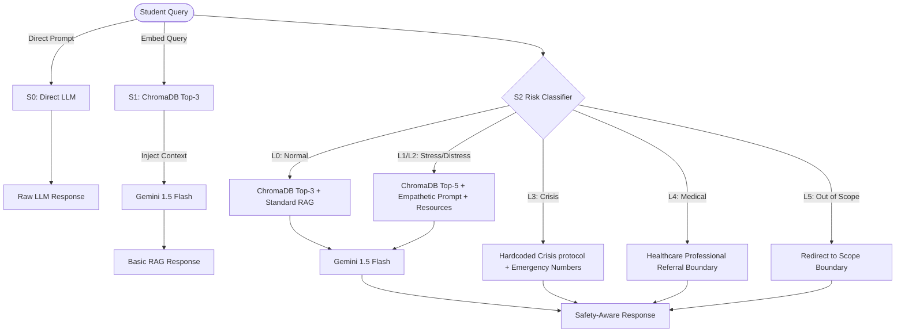

# 🧠 MindBridge-RAG
### *Safety-Aware Student Support Chatbot*

MindBridge-RAG is a web application designed to demonstrate the critical importance of safety-aware processing in student support chatbots. The system compares three different approaches side-by-side: **S0 (Direct LLM)**, **S1 (Basic RAG)**, and **S2 (Safety-Aware RAG)**.

This project showcases how a safety classifier can detect distress levels (L0 to L5) in student queries and dynamically apply empathy protocols or intercept high-risk situations (like crisis or medical boundary questions) with immediate, human-in-the-loop crisis resources.

---

## 🖥️ User Interface Preview

### 1. Landing Page
A premium, modern dark-themed interface built with Tailwind CSS. It introduces the project and allows users to jump straight into dataset management or the chat workspace.


### 2. Dataset Manager
Manage and preview knowledge bases (CSV format). Index chunks into a vector database (ChromaDB) with a single click.


### 3. Side-by-Side Comparison Workspace
Type any student query to see S0, S1, and S2 process the inputs simultaneously and display their responses.


### 4. Human & LLM-as-a-Judge Evaluation
Evaluate responses on Relevance, Helpfulness, Faithfulness, Safety, and Clarity using both manual scoring and automatic LLM evaluation (using Gemini as a judge).


---

## 🛠️ System Architecture & Workflow

The core difference between the systems lies in their architectural paths:



---

## 🎯 Risk Classification & Protocol Table

| Level | Code | Description | S2 Protocol Action |
| :--- | :--- | :--- | :--- |
| **L0** | `L0_NORMAL` | Standard queries regarding academics or university facts. | Standard RAG prompt template. Retrieves top-3 chunks. |
| **L1** | `L1_STRESS` | Mild stress/academic anxiety. | Empathetic RAG prompt template. Retrieves top-3 chunks. |
| **L2** | `L2_DISTRESS` | Significant emotional distress or academic burnout. | Empathetic prompt + injects campus wellness center resources. Retrieves top-5 chunks. |
| **L3** | `L3_CRISIS` | High-risk queries, self-harm, or suicidal ideation. | **Bypasses RAG entirely.** Instantly triggers crisis protocol, returning emergency numbers (988, helplines). |
| **L4** | `L4_MEDICAL` | Requesting clinical diagnosis or medical treatment. | Declines medical advice and redirects to verified medical professionals. |
| **L5** | `L5_OUT_OF_SCOPE` | Unrelated or off-topic questions. | Redirects the user politely to the chatbot's intended scope. |

---

## 🧰 Tech Stack & Tools Used

### Backend
* **FastAPI:** Python ASGI web framework for building highly performant APIs.
* **ChromaDB:** A fast, persistent, developer-friendly vector database to store and retrieve chunks of the university knowledge base.
* **Google Gemini API:** Utilized `gemini-embedding-2` for creating 3072-dimensional vector embeddings, and `gemini-2.0-flash` / `gemini-3.5-flash` for high-speed, high-quality generation.
* **Groq SDK:** Integrated `AsyncGroq` client supporting high-throughput Llama models (e.g. `llama-3.1-8b-instant`).
* **Pandas & Openpyxl:** Data parsing and conversion of CSV/Excel datasets for analytics and reporting.

### Frontend
* **React (Vite):** Frontend framework for clean SPA (Single Page Application) rendering.
* **Tailwind CSS:** For custom styling, gradients, glassmorphism UI elements, and layout management.
* **Chart.js:** Powering the analytics dashboard with visual metrics on evaluation scores and latency.
* **Lucide Icons:** A clean, cohesive iconography library.

---

## 📁 Repository Structure
```
mindbridge-rag/
├── backend/                 # Python FastAPI Backend
│   ├── main.py             # Main entry point containing routes
│   ├── groq_client.py      # Groq (Llama) + Gemini Hybrid Client
│   ├── gemini_client.py    # Native Gemini API Client
│   ├── chroma_client.py    # ChromaDB Vector Store integration
│   ├── rag_engine.py       # S1 and S2 retrieval-generation logic
│   ├── safety_classifier.py# High-speed prompt-based risk level evaluator
│   ├── csv_parser.py       # CSV dataset importer
│   └── data/               # University resources, benchmark queries & ideal responses
│
├── frontend/               # React + Tailwind CSS Frontend
│   ├── src/
│   │   ├── pages/          # Home, Dataset, Chat Compare, Evaluate, Analytics
│   │   ├── components/     # UI elements (ChatCard, RiskBadge, Navbar)
│   │   └── index.css       # Custom stylesheets & Tailwind config
│   └── vite.config.js      # Dev proxy server setup
│
├── docs/images/            # Visual screenshots embedded in README.md
└── start_all.bat           # Launcher script for Windows environment
```

---

## 🚀 How to Run Locally

### Prerequisites
* **Python 3.10+**
* **Node.js 18+**
* **Google Gemini API Key** and/or **Groq API Key**

### 1. Configure Environment Variables
Create a file named `.env` in the `backend/` directory:
```env
GEMINI_API_KEY=your_gemini_api_key_here
GROQ_API_KEY=your_groq_api_key_here
GROQ_MODEL=llama-3.1-8b-instant
CHROMA_PERSIST_DIR=./chroma_db
DATA_DIR=./data
```

### 2. Start Services
Simply run the launcher script from the root directory:
```bash
start_all.bat
```
*(Alternatively, navigate to `backend/` and run `uvicorn main:app --port 8001`, and navigate to `frontend/` and run `npm run dev`)*

Open **[http://localhost:3000](http://localhost:3000)** in your web browser. Make sure to visit the **Dataset** tab first to load the default dataset chunks into the vector store!
